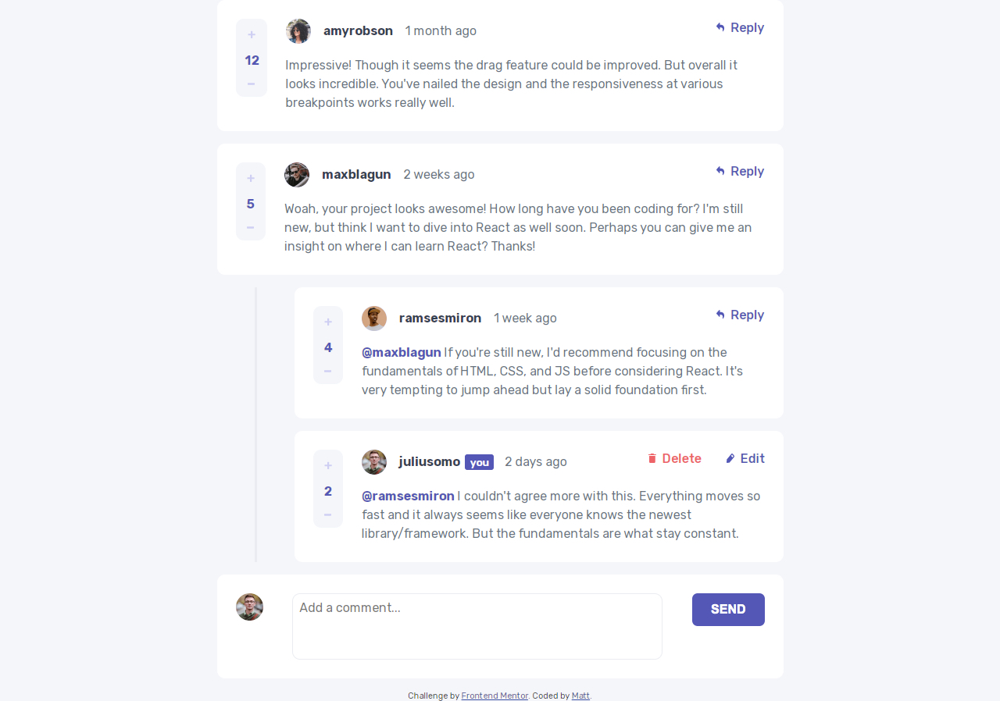

# Frontend Mentor - Interactive comments section solution

This is a solution to the [Interactive comments section challenge on Frontend Mentor](https://www.frontendmentor.io/challenges/interactive-comments-section-iG1RugEG9). Frontend Mentor challenges help you improve your coding skills by building realistic projects. 

## Table of contents

- [Overview](#overview)
  - [The challenge](#the-challenge)
  - [Screenshot](#screenshot)
  - [Links](#links)
- [My process](#my-process)
  - [Built with](#built-with)
  - [What I learned](#what-i-learned)
  - [Continued development](#continued-development)
  - [Useful resources](#useful-resources)
- [Author](#author)
- [Acknowledgments](#acknowledgments)

**Note: Delete this note and update the table of contents based on what sections you keep.**

## Overview

### The challenge

Users should be able to:

- View the optimal layout for the app depending on their device's screen size
- See hover states for all interactive elements on the page
- Create, Read, Update, and Delete comments and replies
- Upvote and downvote comments
- **Bonus**: If you're building a purely front-end project, use `localStorage` to save the current state in the browser that persists when the browser is refreshed.
- **Bonus**: Instead of using the `createdAt` strings from the `data.json` file, try using timestamps and dynamically track the time since the comment or reply was posted.

### Screenshot

### Links

- Solution URL: [Github Repo](https://github.com/mattmakl/fm-interactive-comments-section)
- Live Site URL: [Github Pages](https://github.com/mattmakl/fm-interactive-comments-section)

## My process

### Built with

- Semantic HTML5 markup
- CSS custom properties
- Flexbox
- local storage

### What I learned

I initially used 'import' for the JSON data before realising Firefox didn't support it as standard. Brushed up on fetch using async/await. I had to then move a few functions/calls around to ensure things were in the correct order. 

### Continued development

While I didn't find any single part too difficult, by adding each bit of funcionality incrimentally, the result feels a little cluttered and potentially inefficient as a whole..?. I think I need to work on planning things a bit more up front before diving in. It may have been a better project to use React for, or at least tidy up the JS file by splitting it up.

## Author

- Frontend Mentor - [@mattmakl](https://www.frontendmentor.io/profile/mattmakl)

